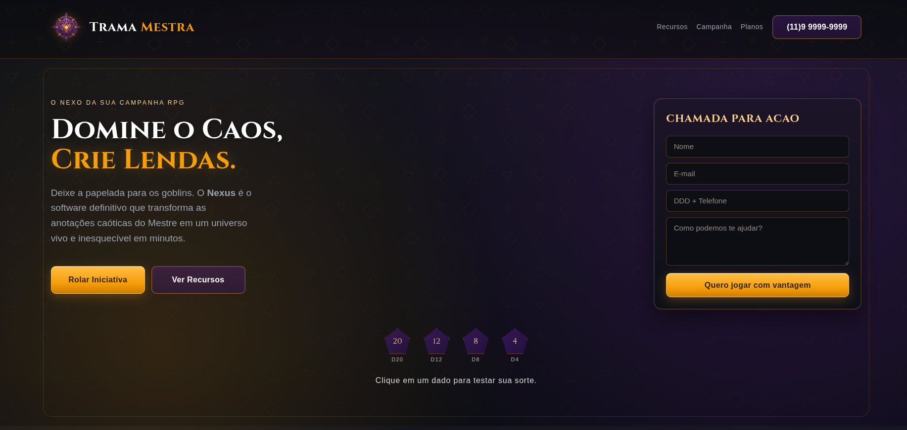
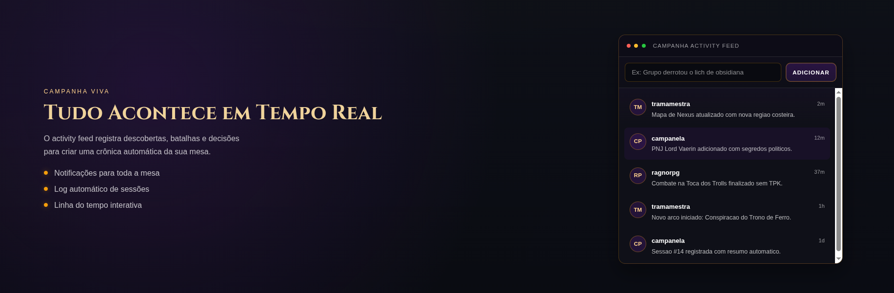
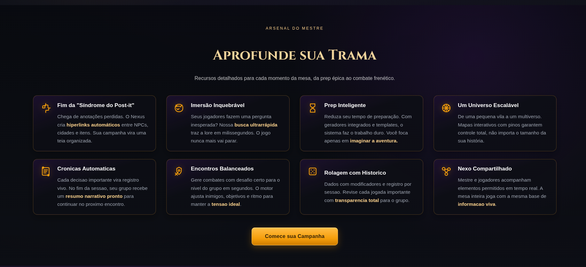
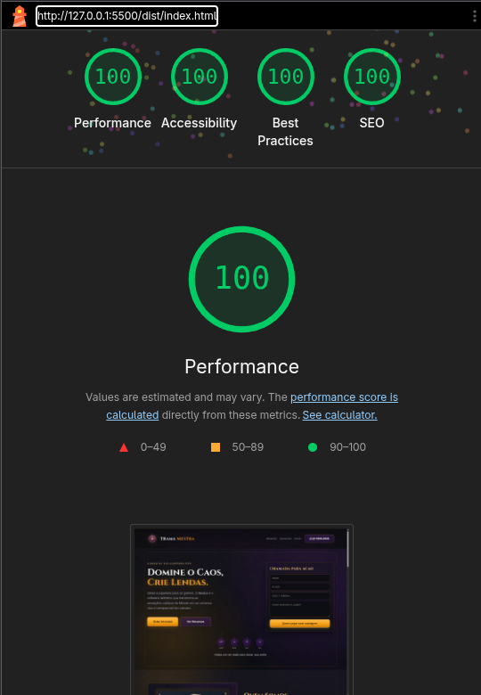

# Trama Mestra

Uma solução inovadora na mestragem de RPGs com o Nexus!

## Visão do projeto
Trama Mestra é uma landing page estática construída para ser rápida, previsível e alinhada à arquitetura existente do projeto.

A abordagem técnica adotada inclui:
- Webpack 5 com `HtmlWebpackPlugin` e `MiniCssExtractPlugin` para gerar o HTML e CSS finais em `dist`.
- SCSS modular no diretório `src/core`, com `main.scss` compondo variáveis, tipografia e estilos globais.
- Fontes carregadas localmente, evitando requests a provedores externos e melhorando a performance de carregamento.
- Uso de `font-display: swap` e fallback para pilha de sistema no corpo do texto.
- Gerenciamento de ativos a partir de `src/index.html` como template, permitindo emissão de imagens e CSS com hashes para cache busting.

Decisões técnicas relevantes:
- Separação de temas e tokens em arquivos SCSS específicos (`_colors.scss`, `_typography.scss`, `_reset.scss`).
- Escolha de `Cinzel` para headings e `Nunito Sans` para texto base, com prioridade de performance.
- Eliminação de dependências externas não essenciais, como Google Fonts, para reduzir a cadeia crítica de rede.
- Extração de CSS para evitar injeção inline e melhorar o cache do navegador.

Vantagens da abordagem:
- Menos dependências externas e mais controle sobre o comportamento de produção.
- Build reproducível e artefatos prontos para deploy em `dist`.
- Melhor desempenho perceptível com fontes locais e assets gerenciados pelo pipeline.
- Arquitetura consistente e fácil de manter, preparada para evolução do projeto.

## Como executar o projeto
1. Clone o repositório:
   ```bash
   git clone https://github.com/Xcode-sketcher/teste-frontend-developer.git
   cd teste-frontend-developer
   ```
2. Instale as dependências:
   ```bash
   npm install
   ```
3. Gere o build de produção:
   ```bash
   npm run build
   ```
4. Abra o site localmente no navegador com:
   ```bash
   npm run preview
   ```
   O comando gera `dist`, inicia um servidor local e tenta abrir o browser automaticamente.
   Se a porta `4173` estiver ocupada, ele tenta `4174` e `4175`.
   Exemplo de URL que deve ser aberta:
   ```text
   http://127.0.0.1:4173
   ```
5. O resultado final também fica em `dist`.
6. Para apenas assistir rebuilds automáticos durante o desenvolvimento:
   ```bash
   npm run build:watch
   ```
   Isso reconstrói `dist` automaticamente, mas não serve os arquivos.

## Tecnologias utilizadas
- JavaScript moderno (ES Modules)
- Webpack 5
- HtmlWebpackPlugin
- MiniCssExtractPlugin
- Sass / SCSS
- css-loader
- sass-loader
- style-loader
- ttf2woff2 (para conversão de fontes em builds locais)
- Estrutura de assets com imagens, fontes e CSS gerenciados pelo pipeline

## Metodologia e boas práticas
- Arquitetura incremental: mantemos o build atual do repositório e evoluímos sobre ele, sem substituir o pipeline existente.
- Modularização de CSS: estilos base, tokens e componentes estão separados em arquivos SCSS no diretório `src/core`.
- Manutenção orientada a componentes: cada seção ou elemento visual tem sua própria área de estilo ou componente, reduzindo acoplamento.
- Componentização por elementos: padrões recorrentes (intro de seção, superfícies de card e marcadores de lista) foram extraídos para `src/components/elements` e reutilizados por múltiplas seções.
- Performance desde o início: fontes carregadas localmente, `font-display: swap`, fallback de sistema e eliminação de requests externos.
- Asset pipeline consistente: imagens, fontes e CSS são processados pelo Webpack para gerar assets com hash em `dist`.
- Produção previsível: o projeto usa build de produção único (`npm run build`) para criar artefatos prontos para deploy.

## Estrutura de pastas
```text
src/
  index.html        # template HTML principal processado pelo Webpack
  index.js          # ponto de entrada JavaScript que importa o SCSS principal
  assets/
    img/            # imagens e vetores usados na página
    icons/          # ícones e pequenos gráficos
    fonts/          # fontes locais usadas pelo CSS
  components/
    elements/
      buttons/      # estilos base de botões
      section-intro/ # mixins de eyebrow, title e description
      surface-card/  # mixin de superfícies/painéis reutilizáveis
      list-markers/  # mixin para marcadores de lista
    sections/       # seções maiores, como header e hero
  core/
    _colors.scss
    _typography.scss
    _reset.scss      # tokens e estilos base
    main.scss        # SCSS principal que reúne todos os estilos

dist/               # saída do build com HTML, CSS, JS e assets otimizados prontos para deploy
docs/
  screenshots/      # capturas de tela usadas na documentação
webpack.config.js   # configuração do pipeline de build
package.json        # scripts, dependências e metadados do projeto
```

## Capturas de tela

### Hero (Topo da página)


### Campaign Feed


### Features


### Resultado Lighthouse (Mobile)



## Sobre o Design

A TramaMestra não nasceu em um escritório de tecnologia do Vale do Silício. Ela nasceu às 3 da manhã, em uma sexta-feira, depois que nosso Mestre perdeu 15 minutos procurando em qual página do caderno estava o nome do estalajadeiro que o grupo resolveu interrogar.

Nós somos um grupo de veteranos de RPG, desenvolvedores e contadores de histórias que se cansaram de lutar contra abas do navegador, planilhas confusas e blocos de notas caóticos. Criamos o Nexus porque precisávamos dele. Queríamos nossa mesa de volta. Queríamos focar em criar reviravoltas épicas, não em organizar papelada. Agora, estamos abrindo os portões dessa fortaleza para você.

### Antes

O Mestre de RPG sobrecarregado, com dezenas de abas abertas, cadernos caóticos, perdendo tempo procurando o nome de um NPC (Personagem Não Jogável) de três sessões atrás, sentindo que a imersão da mesa quebrou.

### Depois

O Mestre se torna um verdadeiro Arquiteto de Mundos. Com o Nexus, ele tem tudo a um clique de distância. A narrativa flui, os jogadores ficam de queixo caído com a preparação, e o Mestre finalmente se diverte e foca na história, não na burocracia.

Deixe a papelada para os goblins. Transforme suas anotações caóticas em um universo vivo e inesquecível em minutos.

## Paleta de Cores e Sensações
A paleta adota o estilo Dark Mode (modo escuro), que remete a noites de jogo e ao desconhecido, mas com contrastes mágicos e vibrantes.

Fundo Principal (Vazio Astral): #121418 (Quase preto, leve tom de azul/cinza).

Sensação: Profundidade, mistério, uma tela em branco no escuro pronta para ser preenchida com imaginação. Não cansa a vista durante horas de leitura.

Cor Primária (Púrpura Arcana): #6B21A8 (Roxo profundo e mágico).

Sensação: Magia, poder, criatividade e fantasia. Usado em cabeçalhos de seções, fundos de cards de destaque.

Cor de Destaque / CTA (Fogo de Dragão): #F59E0B (Âmbar / Dourado vibrante).

Sensação: Ação, urgência, recompensa (ouro) e calor (a fogueira da taverna). Esta é a cor dos seus botões principais (Ex: "Comece sua Campanha Grátis"). O olho do usuário deve ir direto para cá.

Texto Secundário (Papiro Banhado à Lua): #9CA3AF (Cinza claro).

Sensação: Clareza e conforto. Usado para textos longos, garantindo legibilidade sem o contraste agressivo do branco puro.

Acentos de Sucesso (Verde Feérico): #10B981 (Verde esmeralda).

Sensação: Crescimento, cura, acerto crítico (Rolagem de D20). Usado para checkmarks e benefícios.


## Padrões de Design (UI/UX)
Arredondamento de Bordas (Border-Radius): * Padrão: 8px para botões e campos de formulário.

Cards e Módulos: 16px.

Sensação transmitida: As bordas médias transmitem uma sensação de "pedras polidas" ou "gemas", algo tátil, amigável e moderno. Foge do aspecto corporativo quadrado (0px) e do aspecto excessivamente infantil/brincalhão de bordas em formato de pílula (50px).

Sombras e Profundidade (Glow em vez de Drop Shadow):

Como o fundo é escuro, em vez de sombras pretas, use um Glow (brilho difuso) sutil nas cores primárias para destacar elementos.

Exemplo: O botão de Call to Action dourado deve ter um brilho dourado suave ao redor ao passar o mouse (Hover). Isso passa a sensação de que o botão é um item mágico pulsando energia.

Texturas Subliminares:

Pequenos ruídos granulares (noise) ou ilustrações isométricas muito sutis em baixa opacidade (5%) no background para não deixar a tela "chapada", remetendo a pergaminhos escuros ou mapas estelares.


## Tipografia
A escolha das fontes deve equilibrar a estética épica da fantasia com a funcionalidade de um software moderno.

Títulos e Chamadas (Headings - H1, H2, H3): Cinzel.

Sensação: Épica, histórica, clássica. Lembra capas de livros de fantasia medieval, feitiços e lendas antigas. Traz autoridade e grandeza à promessa do produto.

Corpo do Texto e Interface (Paragraphs, Buttons, Menus): Nunito Sans.

Sensação: Moderna, limpa, extremamente legível. Mostra que por trás da "magia" da fantasia, existe um software robusto, rápido e confiável que o usuário conseguirá usar sem fricção.

[Protótipo - Figma](https://www.figma.com/design/8vw1VOA7UXanE5JKfpoX8G/Sem-t%C3%ADtulo?node-id=0-1&t=ZiyzHbps43h4LE1H-1)